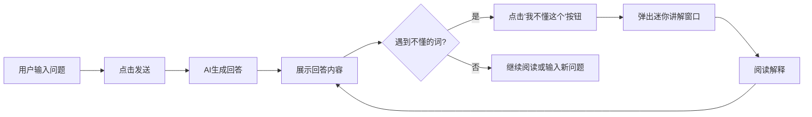

## 1. Product Overview
傻瓜教程是一款AI驱动的交互式学习应用，用户输入问题后AI给出解答，用户可点击任何词语旁的"我不懂这个"按钮获得即时嵌套式迷你讲解，实现深度理解和知识探索。
- 主要目的：帮助用户通过交互式方式理解复杂概念，支持逐层深入学习
- 目标用户：学生、自学爱好者、需要快速理解专业术语的职场人士

## 2. Core Features

### 2.1 User Roles
| Role | Registration Method | Core Permissions |
|------|---------------------|------------------|
| Normal User |无需注册|使用问答功能和迷你讲解|

### 2.2 Feature Module
1. **主界面**: 输入区域、AI回答展示区、即时解释交互
2. **迷你讲解窗口**: 嵌套式弹出、词语释义、相关链接

### 2.3 Page Details
| Page Name | Module Name | Feature description |
|-----------|-------------|---------------------|
| 主界面 | 输入区域 | 用户输入问题或主题，支持回车键提交 |
| 主界面 | AI回答展示 | 显示AI生成的回答，每个词语旁有"我不懂这个"按钮 |
| 主界面 | 迷你讲解窗口 | 点击按钮后在当前位置弹出迷你窗口，展示词语解释 |
| 主界面 | 历史记录 | 显示最近的问答记录，支持快速回顾 |

## 3. Core Process
用户在输入框中输入问题 → 点击发送按钮 → AI生成回答并展示 → 用户阅读回答 → 遇到不理解的词时点击旁边的"我不懂这个"按钮 → 弹出嵌套式迷你讲解窗口 → 用户阅读解释 → 点击关闭按钮或继续探索其他词语

## 4. User Interface Design

### 4.1 Design Style
- 主色调：温暖的橙色(#FF6B35)搭配深蓝色(#1E3A5F)
- 次色调：浅灰(#F5F5F5)作为背景
- 按钮风格：圆角矩形，悬停时有缩放动画
- 字体：使用"Noto Sans SC"作为主要字体，清晰易读
- 布局：卡片式设计，干净整洁
- 图标：使用lucide-react图标库

### 4.2 Page Design Overview
| Page Name | Module Name | UI Elements |
|-----------|-------------|-------------|
| 主界面 | 顶部导航 | Logo、应用名称、简洁标题 |
| 主界面 | 输入区域 | 文本输入框、发送按钮、清空按钮 |
| 主界面 | AI回答区 | 卡片式展示、带按钮的词语、滚动支持 |
| 主界面 | 迷你讲解窗口 | 弹出式设计、深色背景、白色文字、关闭按钮 |
| 主界面 | 历史记录 | 侧边栏或底部列表、时间戳、问题预览 |

### 4.3 Responsiveness
- 桌面优先设计，支持1280px及以上分辨率
- 平板适配：768px-1024px，调整布局为单列
- 移动端适配：320px-767px，优化触摸体验，按钮尺寸增大

### 4.4 Key Interaction Details
- "我不懂这个"按钮：悬停时显示完整文字，默认显示问号图标
- 迷你讲解窗口：淡入动画，点击外部自动关闭
- 回答内容：支持Markdown渲染，代码块高亮