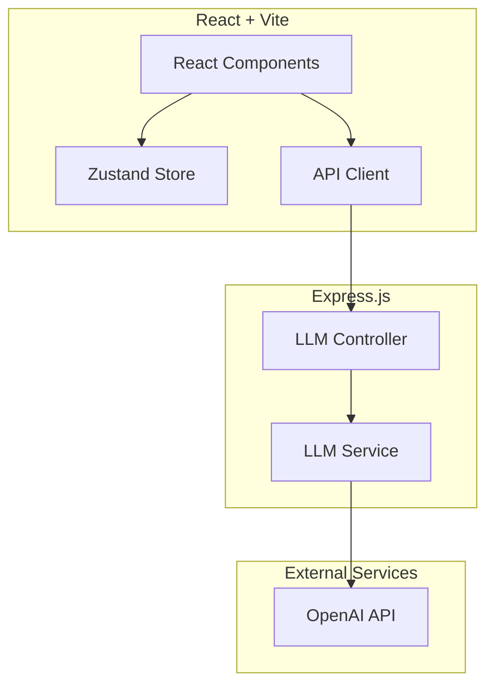
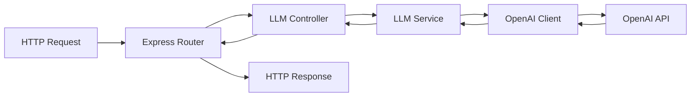
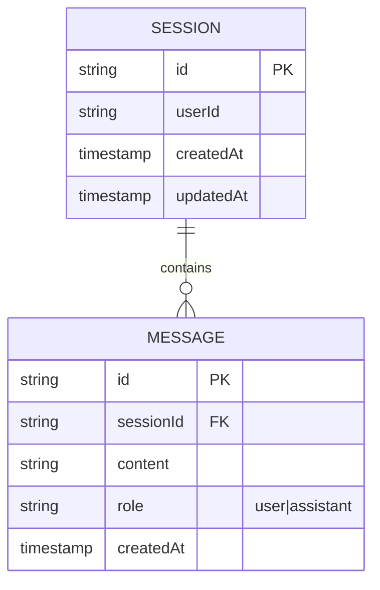

## 1. Architecture Design



## 2. Technology Description

* Frontend: React\@18 + TypeScript + Tailwind CSS\@3 + Vite

* State Management: Zustand

* Icons: lucide-react

* Backend: Express.js\@4 + TypeScript

* LLM Integration: OpenAI API (GPT-4)

* HTTP Client: axios

## 3. Route Definitions

| Route | Purpose            |
| ----- | ------------------ |
| /     | 主界面，包含输入、回答和迷你讲解功能 |

## 4. API Definitions

### 4.1 Chat API

* **POST** `/api/chat`

* **Purpose**: 获取AI回答

* **Request Body**:

```typescript
interface ChatRequest {
  message: string;
  sessionId?: string;
}
```

* **Response Body**:

```typescript
interface ChatResponse {
  id: string;
  content: string;
  words: WordInfo[];
  sessionId: string;
}
```

### 4.2 Word Explanation API

* **POST** `/api/explain`

* **Purpose**: 获取单个词语的详细解释

* **Request Body**:

```typescript
interface ExplainRequest {
  word: string;
  context?: string;
}
```

* **Response Body**:

```typescript
interface ExplainResponse {
  word: string;
  definition: string;
  examples: string[];
  relatedTerms: string[];
}
```

## 5. Server Architecture Diagram



## 6. Data Model

### 6.1 Data Model Definition



### 6.2 Data Definition Language

```sql
CREATE TABLE sessions (
    id VARCHAR(255) PRIMARY KEY,
    user_id VARCHAR(255),
    created_at TIMESTAMP DEFAULT CURRENT_TIMESTAMP,
    updated_at TIMESTAMP DEFAULT CURRENT_TIMESTAMP
);

CREATE TABLE messages (
    id VARCHAR(255) PRIMARY KEY,
    session_id VARCHAR(255) REFERENCES sessions(id),
    content TEXT,
    role VARCHAR(20) CHECK (role IN ('user', 'assistant')),
    created_at TIMESTAMP DEFAULT CURRENT_TIMESTAMP
);

CREATE INDEX idx_messages_session_id ON messages(session_id);
```

## 7. Project Structure

```
.
├── src/
│   ├── components/
│   │   ├── ChatInput.tsx
│   │   ├── ChatResponse.tsx
│   │   ├── WordButton.tsx
│   │   ├── MiniExplanation.tsx
│   │   └── HistoryPanel.tsx
│   ├── hooks/
│   │   └── useChat.ts
│   ├── store/
│   │   └── chatStore.ts
│   ├── types/
│   │   └── index.ts
│   ├── utils/
│   │   └── apiClient.ts
│   ├── App.tsx
│   └── main.tsx
├── api/
│   ├── src/
│   │   ├── controllers/
│   │   │   └── llmController.ts
│   │   ├── services/
│   │   │   └── llmService.ts
│   │   ├── routes/
│   │   │   └── index.ts
│   │   ├── types/
│   │   │   └── index.ts
│   │   └── server.ts
│   └── package.json
├── package.json
├── tsconfig.json
├── vite.config.ts
└── tailwind.config.js
```

